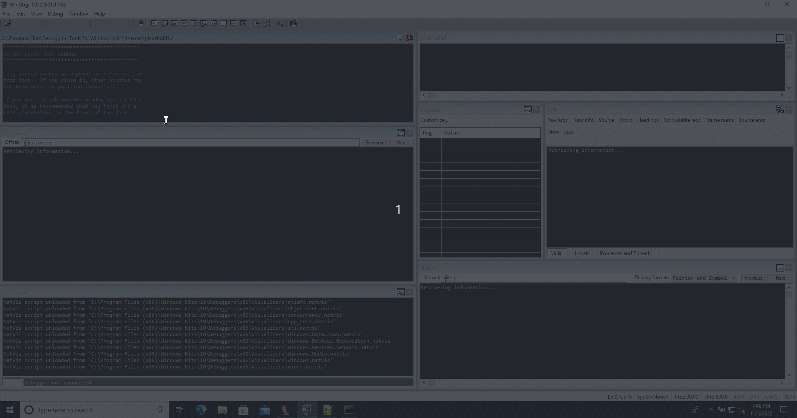

# windbg-code-tracing


Pykd script to trace the control flow executed (CFE) from source to sink point.

Notes:

 - external calls are not supported, for now

 - there can be more than one path from source to sink point, but only one source point and sink point, for now

 - For generating the path from source to sink point [alleycat](https://github.com/tin-z/IDC_OSED_scripts/tree/main/plugins/alleycat) idc script can be used.


----

### usage:

```windbg
.load pykd.pyd

!py cfe_trace.py --help

usage: cfe_trace.py [-h] --source SOURCE --sink SINK --binary_name BINARY_NAME
                    --old_baddr OLD_BADDR --chains CHAINS [--sink_is_bb]
                    [--debug] [--stop] [--dec]

Trace control flow executed from source to sink point

optional arguments:
  -h, --help            show this help message and exit
  --source SOURCE       Source point address
  --sink SINK           Sink point address
  --binary_name BINARY_NAME
                        Binary file name
  --old_baddr OLD_BADDR
                        Base address used on the variable 'chains' which does
                        represent addresses to trace
  --chains CHAINS       List of addresses (path) to trace
  --sink_is_bb          Sink point is a basic block (BB) and not a function
                        block (FB)
  --debug               increase output verbosity (default: False)
  --stop                Stop after reachng sink point (default: True)
  --dec                 Do not decrement counters after leaving a FB, this can
                        put less pressure on control-flow path restrictions
                        (default: True)
```


 - example: trace CFE from 0x66601AA0 to 0x66601130

```windbg
!py cfe_trace.py --debug --source 0x66601AA0 --sink 0x66601130 --binary_name "egghunter_extra_mile.exe" --old_baddr 0x66600000 --chains "[ [0x66601AA0, 0x66601690, 0x66601130]]"

```




